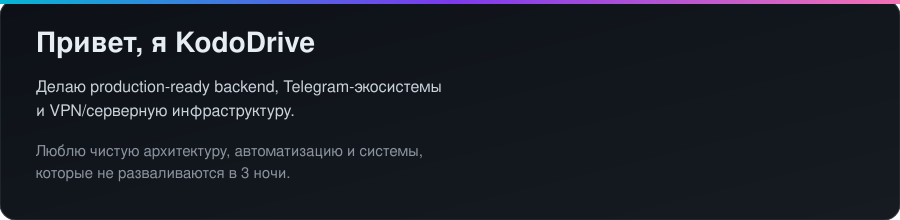
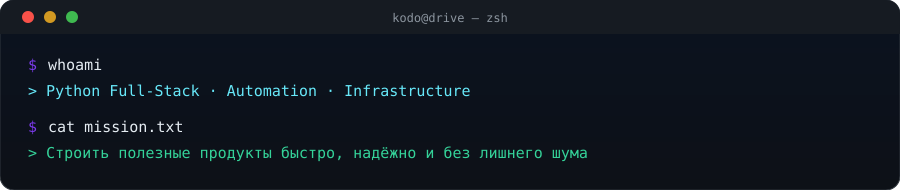
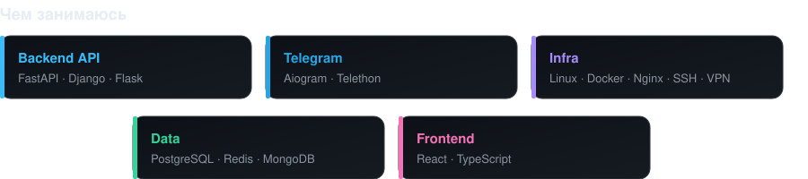
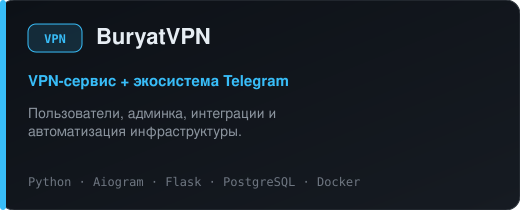
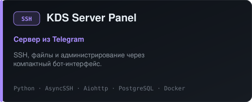
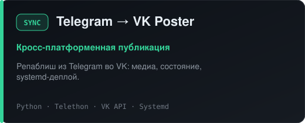
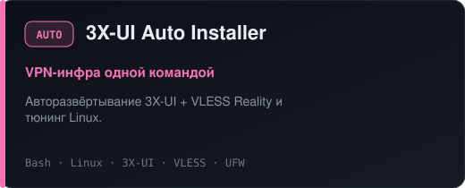
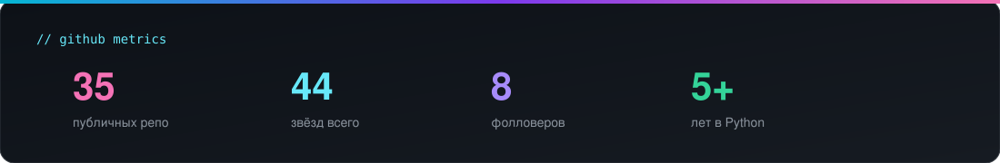

  

  

 

  
  
  

 

  
  
  
  

---

##  Обо мне

  

 

  

 

  

 

  

 

  
  
  
  

---

## 🚀 Избранные проекты

  
  

 

  
  

  

---

## 📈 GitHub

  

 

  
  

 

  

 

  
  

  
  

  <picture>
    <source media="(prefers-color-scheme: dark)" srcset="https://raw.githubusercontent.com/svod011929/svod011929/output/github-contribution-grid-snake-dark.svg" />
    <source media="(prefers-color-scheme: light)" srcset="https://raw.githubusercontent.com/svod011929/svod011929/output/github-contribution-grid-snake.svg" />
    
  </picture>

---

<!-- kododrive-projects-block -->

## 🗂️ Все проекты KodoDrive

<b>VPN и инфраструктура</b>

- [BuryatVPN — VPN-сервис + Telegram](https://github.com/svod011929/buryatvpn)
- [VPN Server Installer — VLESS + TLS](https://github.com/svod011929/vpn-server-installer)
- [3X-UI Auto Installer](https://github.com/svod011929/3x-ui-auto-installer)
- [AWG Bot Installer — AmneziaWG](https://github.com/svod011929/awg-bot-installer)
- [RemnaShop Installer](https://github.com/svod011929/remnashop-installer)
- [VPN Auto Installer — панели](https://github.com/svod011929/vpn-auto-installer)
- [VPNHubBot — Telegram VPN-бот](https://github.com/svod011929/VPNHubBot)

<b>Telegram и автоматизация</b>

- [KDS Server Panel — SSH из Telegram](https://github.com/svod011929/KDS_Server_Panel)
- [Telegram → VK Poster](https://github.com/svod011929/telegram-to-vk-poster)
- [KDS Parser CryptoBot](https://github.com/svod011929/kds_parser_cryptobot)
- [Auction Bot](https://github.com/svod011929/auction-bot)
- [Invest Bot](https://github.com/svod011929/invest-bot)
- [Crypto Check Bot](https://github.com/svod011929/crypto-check-bot)
- [KodoRefStarsBot](https://github.com/svod011929/KodoRefStarsBot)

<b>Магазины и финансы</b>

- [KodoCashFlow](https://github.com/svod011929/KodoCashFlow)
- [Telegram Crypto Shop](https://github.com/svod011929/telegram-crypto-shop)
- [TalkProfit](https://github.com/svod011929/talkprofit)

<b>Сайты</b>

- [KodoDrive Portfolio](https://github.com/svod011929/kododrive-portfolio)
- [kododrive.github.io](https://github.com/svod011929/kododrive.github.io)

  Профиль: <a href="https://github.com/svod011929">@svod011929</a> ·
  Сайт: <a href="https://kododrive.ru">kododrive.ru</a> ·
  Telegram: <a href="https://t.me/KodoDrive">@KodoDrive</a>

<!-- /kododrive-projects-block -->

---

## 🎯 Сейчас в фокусе

> Практичные продукты вокруг **Python-автоматизации, Telegram-платформ, backend API и VPN/серверной инфраструктуры**.

Открыт к **фрилансу, контрактам, open source и консалтингу**.

### Давай соберём что-то мощное.

&nbsp;

  

