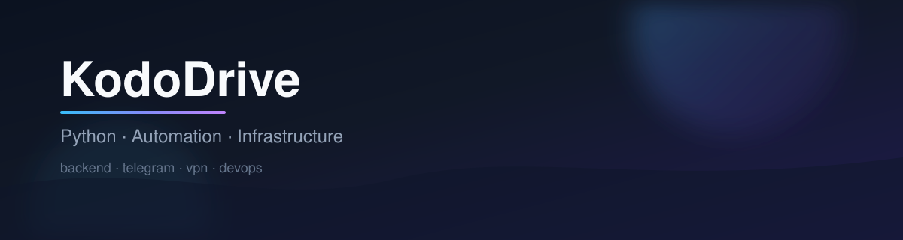

  

 

### Python Full-Stack · автоматизация · инфраструктура

Production-ready backend, Telegram-экосистемы и VPN/серверные решения.  
Чисто, стабильно, без лишнего шума.

  
  &nbsp;
  
  &nbsp;
  
  &nbsp;
  

 

  

## Обо мне

Пишу сервисы, которые живут в проде: API, боты, инсталляторы, панели и автоматизация вокруг Linux/VPN.

| Направление | Стек |
| --- | --- |
| **Backend** | FastAPI, Django, Flask |
| **Telegram** | Aiogram, Telethon |
| **Infra** | Linux, Docker, Nginx, SSH, VLESS / Reality / Amnezia |
| **Data** | PostgreSQL, Redis, MongoDB |
| **Frontend** | React, TypeScript |

  

 

  

## Избранные проекты

<table>
<tr>
<td width="50%" valign="top">

#### [BuryatVPN](https://github.com/svod011929/buryatvpn)
VPN-сервис + Telegram-экосистема  
`Python` `Aiogram` `PostgreSQL` `Docker`

</td>
<td width="50%" valign="top">

#### [KDS Server Panel](https://github.com/svod011929/KDS_Server_Panel)
Управление сервером из Telegram  
`AsyncSSH` `Aiohttp` `PostgreSQL`

</td>
</tr>
<tr>
<td width="50%" valign="top">

#### [VPN Server Installer](https://github.com/svod011929/vpn-server-installer)
VLESS + TLS одной командой  
`Bash` `Linux` `VPN`

</td>
<td width="50%" valign="top">

#### [3X-UI Auto Installer](https://github.com/svod011929/3x-ui-auto-installer)
Авторазвёртывание 3X-UI / Reality  
`Bash` `3X-UI` `UFW`

</td>
</tr>
<tr>
<td width="50%" valign="top">

#### [Telegram → VK Poster](https://github.com/svod011929/telegram-to-vk-poster)
Надёжный репаблиш каналов  
`Telethon` `VK API` `Systemd`

</td>
<td width="50%" valign="top">

#### [AWG Bot Installer](https://github.com/svod011929/awg-bot-installer)
AmneziaWG под ключ  
`Bash` `AmneziaWG` `Linux`

</td>
</tr>
</table>

  <a href="https://github.com/svod011929?tab=repositories"><strong>Все репозитории →</strong></a>

  

<!-- kododrive-projects-block -->

## Проекты KodoDrive

<b>VPN и инфраструктура</b>

- [BuryatVPN](https://github.com/svod011929/buryatvpn)
- [VPN Server Installer](https://github.com/svod011929/vpn-server-installer)
- [3X-UI Auto Installer](https://github.com/svod011929/3x-ui-auto-installer)
- [AWG Bot Installer](https://github.com/svod011929/awg-bot-installer)
- [RemnaShop Installer](https://github.com/svod011929/remnashop-installer)
- [VPN Auto Installer](https://github.com/svod011929/vpn-auto-installer)
- [VPNHubBot](https://github.com/svod011929/VPNHubBot)

<b>Telegram и автоматизация</b>

- [KDS Server Panel](https://github.com/svod011929/KDS_Server_Panel)
- [Telegram → VK Poster](https://github.com/svod011929/telegram-to-vk-poster)
- [KDS Parser CryptoBot](https://github.com/svod011929/kds_parser_cryptobot)
- [Auction Bot](https://github.com/svod011929/auction-bot)
- [Invest Bot](https://github.com/svod011929/invest-bot)
- [Crypto Check Bot](https://github.com/svod011929/crypto-check-bot)
- [KodoRefStarsBot](https://github.com/svod011929/KodoRefStarsBot)

<b>Магазины и финансы</b>

- [KodoCashFlow](https://github.com/svod011929/KodoCashFlow)
- [Telegram Crypto Shop](https://github.com/svod011929/telegram-crypto-shop)
- [TalkProfit](https://github.com/svod011929/talkprofit)

<b>Сайты</b>

- [KodoDrive Portfolio](https://github.com/svod011929/kododrive-portfolio)
- [kododrive.github.io](https://github.com/svod011929/kododrive.github.io)

<!-- /kododrive-projects-block -->

 

  
    
  
  &nbsp;
  

